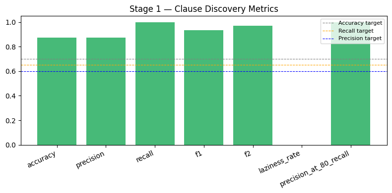
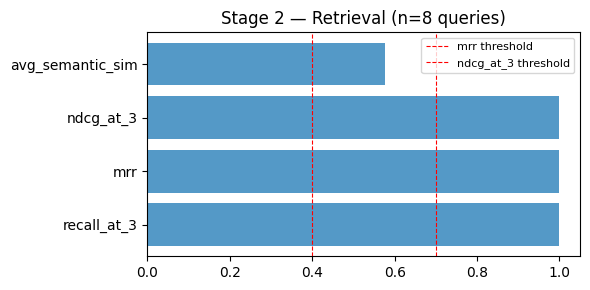
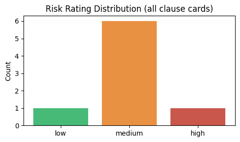

# Contract Clause Risk Review Agent

An agentic pipeline that analyses commercial contracts against four high-risk clause families, retrieves precedents from 80 reference contracts [CUAD Dataset](https://github.com/TheAtticusProject/cuad), and generates structured risk cards via LLM calls.

---

## Features
Following are some of the features I have taken into account with respect to the constraints.

- **Clause Discovery** — finds clause spans using local sentence embeddings. No LLM, no external DB. Retries with a broader anchor set before giving up.
- **Precedent Retrieval** — queries a Pinecone (or ChromaDB) vector index of 80 reference contracts. Returns up to 3 similar and 3 contrasting precedents per clause family.
- **Structured Interpretation** — regex heuristics for deterministic fields + one targeted LLM call for semantic fields (consent scope, acquirer binding, exclusivity scope).
- **LLM Risk Rating** — one LLM call per clause family produces `risk_rating`, `risk_rationale`, and `confidence_uncertainty_notes`. Retries once on JSON parse failure; degrades gracefully on second failure.
- **Rule-Based Aggregate Risk** — `max(cards)` with no extra LLM call. On-demand summary available separately.
- **Dual Vector Backend** — Pinecone (cloud, free tier) and ChromaDB (local) are both supported. `build_index.py` can populate both in parallel.
- **FastAPI Backend** — async job queue (ThreadPoolExecutor), in-process job store, polling endpoint.

---

## Pipeline
The architecture for the project follows a Agentic Loop hueristic. The pipeline tests
clause discovery using `anchor queries`, if the score is below a threshold the agent retries using a broader anchor length. The next step is precedent retrieval using the found clause and search for similar and contrasting clauses.  Any failure is given retry logic and a failure handler as well. Final llm call is done on the retrieved information for final interpretation and risk rating. The summary since not really required is not explicitely done in the loop but can be done towards the end as well. Jinja2 Templates are used for now.

```
Raw contract text (.txt)
        │
        ▼  repeated for each selected clause family
┌───────────────────────────────────────────────────────┐
│ Step 1 — Clause Discovery                             │
│   Local embeddings only (sentence-transformers)       │
│   5 anchor queries → cosine similarity → top-K merge  │
│   Retry: broad anchors + relaxed threshold (0.85×)    │
│   LLM calls: 0                                        │
└───────────────────────────────────────────────────────┘
        │ {found, extracted_text, score}
        ▼
┌───────────────────────────────────────────────────────┐
│ Step 2 — Precedent Retrieval                          │
│   Pinecone / ChromaDB  (skipped if clause not found)  │
│   Similar:     1 batch LLM call → why_similar ×N     │
│   Contrasting: 1 batch LLM call → top-3 selection    │
│   LLM calls: 2                                        │
└───────────────────────────────────────────────────────┘
        │ similar[≤3], contrasting[≤3]
        ▼
┌───────────────────────────────────────────────────────┐
│ Step 3 — Interpretation + Risk Rating                 │
│   Pass 1: regex/keyword heuristics (no LLM)          │
│   Pass 2: 0–1 LLM call for semantic fields            │
│   Risk Rating: 1 LLM call, 1 retry on parse failure  │
│   LLM calls: 1–3                                      │
└───────────────────────────────────────────────────────┘
        │ ClauseCard
        ▼  after all families
┌───────────────────────────────────────────────────────┐
│ Step 4 — Aggregation                                  │
│   Rule-based overall risk (max of cards)              │
│   LLM calls: 0                                        │
│                                                       │
│   Optional: POST /review/{id}/summarize               │
│   1 LLM call → overall_summary + top_red_flags        │
└───────────────────────────────────────────────────────┘
        │ ContractReviewOutput
        ▼
  output/json/{contract_id}.json
  output/html/{contract_id}.html
```

**LLM call budget per contract (all 4 families found):**

| Step | Calls (happy path) | Calls (worst case) |
|------|-------------------|--------------------|
| Precedent retrieval × 4 | 8 | 8 |
| Interpretation semantic × 3 | 3 | 3 |
| Risk rating × 4 | 4 | 8 (all retry) |
| Aggregation summary (optional) | 1 | 1 |
| **Total** | **15** | **19** |

---

## Repository Layout

```
├── config.py                        # All paths, constants, model names
│
├── agent/
│   ├── models.py                    # Pydantic schemas
│   ├── loop.py                      # Orchestrator — Steps 1–4 with retry
│   ├── clause_discovery.py          # Step 1: embedding-based clause finder
│   ├── interpretation.py            # Step 3a: heuristic + LLM interpretation
│   ├── precedent_retrieval.py       # Step 2: Pinecone/ChromaDB queries
│   ├── risk_rating.py               # Step 3b: LLM risk card + retry
│   └── summarizer.py                # Step 4: rule-based + optional LLM summary
│
├── services/
│   ├── generation/
│   │   ├── base.py                  # Abstract LLMClient
│   │   └── claude_client.py         # Anthropic Claude implementation
│   ├── retrieval/
│   │   ├── retriever.py             # Pinecone query interface (active)
│   │   └── retriever_chroma.py      # ChromaDB query interface (backup)
│   ├── indexing/
│   │   ├── indexer.py               # Pinecone indexing service
│   │   └── indexer_chroma.py        # ChromaDB indexing service (backup)
│   ├── ingestion/
│   │   └── ingestor.py              # .txt → normalised plain text
│   ├── output/
│   │   ├── json_writer.py           # ContractReviewOutput → JSON
│   │   └── html_renderer.py         # Jinja2 HTML report
│   └── logging_setup.py             # Loguru config + stdlib intercept
│
├── api/
│   ├── routes.py                    # FastAPI app + all endpoints
│   └── models.py                    # Job/response Pydantic models
│
├── scripts/
│   ├── prepare_data.py              # 80/20 CUAD split, annotation JSONs
│   ├── build_index.py               # Embed + upsert → Pinecone and/or ChromaDB
│   ├── run_review.py                # CLI entrypoint
│   ├── test_api.sh                  # End-to-end curl test script
│   └── deploy/
│       ├── setup_ec2.sh             # One-time EC2 bootstrap
│       ├── deploy.sh                # Pull + restart
│       ├── nginx.conf               # Nginx reverse proxy config
│       └── contract-review.service  # Systemd unit file
│
├── templates/report.html            # Jinja2 HTML report template
├── data/
│   ├── reference/                   # 80 reference .txt files
│   ├── test/                        # 20 test .txt files
│   └── chroma_db/                   # ChromaDB persistence (gitignored)
└── output/
    ├── json/                        # Review output JSON files
    ├── html/                        # Review output HTML reports
    └── logs/                        # Rotating loguru logs
```

---

## Quick Start

### Prerequisites

- Python 3.11+
- [`uv`](https://github.com/astral-sh/uv) — `curl -LsSf https://astral.sh/uv/install.sh | sh`
- Anthropic API key
- Pinecone API key (free tier — [pinecone.io](https://www.pinecone.io))
- CUAD dataset (`full_contracts_txt/` and `master_clauses.csv` in `data/cuad_raw/`)

### 1. Install

```bash
git clone <repo-url>
cd contract-review

uv venv venv
source venv/bin/activate          # Windows: venv\Scripts\activate

uv pip install -r requirements.txt
```

### 2. Environment Variables

Create `.env` in the project root:

```env
ANTHROPIC_API_KEY=sk-ant-...
PINECONE_API_KEY=pc-...
PINECONE_INDEX_NAME=cuad-contracts
PINECONE_CLOUD=aws
PINECONE_REGION=us-east-1

# Optional
LOG_LEVEL=INFO                    # DEBUG for token counts and chunk scores
```

### 3. Prepare Data (one time)

```bash
# Split CUAD into 80 reference + 20 test contracts
python3 scripts/prepare_data.py
```

### 4. Build the Vector Index (one time)

```bash
# Both backends in parallel (fastest)
python3 scripts/build_index.py --chromadb &
python3 scripts/build_index.py --pinecone &
wait

# Or one at a time
python3 scripts/build_index.py --pinecone     # Pinecone only
python3 scripts/build_index.py --chromadb     # ChromaDB only
python3 scripts/build_index.py                # both sequentially
```

First Pinecone run provisions the `cuad-contracts` index (~60 s). Subsequent runs upsert directly (idempotent).

### 5. Run a Review (CLI)

```bash
python3 scripts/run_review.py --contract data/test/SomeContract.txt

# All 20 test contracts
python3 scripts/run_review.py --all-test
```

### 6. Start the API Server

```bash
uvicorn api.routes:app --reload --port 8000
```

Open `http://localhost:8000/docs` for the auto-generated Swagger UI.

---

## API Reference

All endpoints are served from `http://localhost:8000`.

### `POST /review`

Submit a contract for review. Returns a `job_id` immediately; the review runs asynchronously.

| Field | Type | Description |
|-------|------|-------------|
| `contract_text` | Form string | Raw contract text (mutually exclusive with `file`) |
| `file` | File upload | `.txt` file (mutually exclusive with `contract_text`) |
| `families` | Form string | Comma-separated families or `"all"` (default). Valid: `assignment`, `change_of_control`, `termination`, `exclusivity` |
| `model` | Form string | Claude model ID (default: `claude-haiku-4-5-20251001`). See `GET /models`. |

```bash
# Text input, single family
curl -X POST http://localhost:8000/review \
  -F "contract_text=..." \
  -F "families=termination" \
  -F "model=claude-sonnet-4-6"

# File upload, all families
curl -X POST http://localhost:8000/review \
  -F "file=@data/test/MyContract.txt"
```

**Response `202`:**
```json
{
  "job_id": "abc-123",
  "contract_id": "MyContract_7f0f4141",
  "families": ["termination"],
  "model": "claude-sonnet-4-6",
  "status": "pending"
}
```

---

### `GET /review/{job_id}`

Poll job status. When `status == "done"` the full `result` object is included.

**Status values:** `pending` → `running` → `done` | `failed`

```bash
curl http://localhost:8000/review/abc-123
```

---

### `POST /review/{job_id}/summarize`

Generate `overall_summary` and `top_red_flags` on demand (1 LLM call). Updates the stored job result. Only available when `status == "done"`.

```bash
curl -X POST http://localhost:8000/review/abc-123/summarize
```

---

### `GET /review/{job_id}/report`

Returns the rendered HTML report. Only available when `status == "done"`.

---

### `GET /models`

Lists available Claude models and the current default.

### `GET /families`

Lists the four clause families with display names and descriptions.

### `GET /health`

Liveness check. Returns `{"status": "ok"}`.

---

## Testing the API

```bash
# Local server (default)
./scripts/test_api.sh

# Against a deployed server
BASE_URL=http://YOUR_EC2_IP ./scripts/test_api.sh

# Single family, cheapest model
FAMILIES=termination MODEL=claude-haiku-4-5-20251001 ./scripts/test_api.sh

# From a real contract file
CONTRACT_FILE=data/test/SomeContract.txt ./scripts/test_api.sh
```

---

## Evaluation

The project ships with a multi-stage benchmark suite grounded in published legal-retrieval benchmarks: **CUAD** (clause discovery), **ACORD** (retrieval), **ContractEval** (F2, laziness rate, LLM-as-judge), and **LegalBench-RAG** (nDCG/MRR thresholds). See [`GUIDE.md`](./GUIDE.md) for the full metric definitions and reasoning behind each one.

### Run the evaluation

```bash
# Prereq: pipeline outputs must exist for the 20 held-out test contracts
python3 scripts/run_review.py --all-test

# Quick mode — no LLM calls, ~5 seconds
python3 scripts/evaluate.py --quick

# Full mode — adds LLM-as-judge (1 API call per found clause card)
python3 scripts/evaluate.py --full

# A single stage only (useful when debugging one metric family)
python3 scripts/evaluate.py --stage discovery
python3 scripts/evaluate.py --stage retrieval
python3 scripts/evaluate.py --stage interpretation
python3 scripts/evaluate.py --stage risk
```

Results stream to `output/eval/results.json` and a stdout table:

```
==========================================================
  CONTRACT REVIEW PIPELINE — EVALUATION RESULTS
==========================================================
  Metric                          Value    Target   Pass
----------------------------------------------------------
  Accuracy                       0.875      0.70    ✓
  Precision                      0.875      0.60    ✓
  Recall                         1.000      0.65    ✓
  F1                             0.933       N/A    —
  F2                             0.972       N/A    —
  P@80% Recall                   1.000       N/A    —
  Recall@3                       1.000       N/A    —
  MRR                            1.000      0.40    ✓
  nDCG@3                         1.000      0.70    ✓
  Field completeness             1.000       N/A    —
  Heuristic agree %              0.750       N/A    —
==========================================================
```

### Stages and what they measure

| Stage | What it scores | Key metrics |
|-------|----------------|-------------|
| **1. Clause Discovery** | Did we find the clause at all? | Accuracy, Precision, Recall, F1, F2 (recall-weighted), Laziness Rate, P@80%Recall |
| **2. Precedent Retrieval** | Are the retrieved precedents relevant? | Recall@3, MRR, nDCG@3, avg semantic similarity |
| **3. Interpretation** | Did the LLM populate all structured fields? | Field completeness rate (per family + overall) |
| **4a. Risk Rating (heuristic)** | Does the LLM rating match a deterministic rule-based label? | Heuristic agreement % |
| **4b. Risk Rating (LLM-judge)** | Is the rating + rationale defensible? | Avg judge score (1–5), pass %, Jaccard similarity |

Targets:

| Metric | Target |
|--------|--------|
| Clause Found Accuracy | > 0.70 |
| Clause Discovery Recall | > 0.65 |
| Clause Discovery Precision | > 0.60 |
| Risk Distribution | Not all same level |

### Results showcase

Generated from `notebooks/eval_analysis.ipynb` after running `scripts/evaluate.py --quick`.

**Stage 1 — Clause Discovery** (all targets met):



**Stage 2 — Retrieval Quality** (production-grade per LegalBench-RAG thresholds — MRR > 0.40, nDCG > 0.70):



**Stage 4 — Risk Distribution** across all cards (not collapsed onto a single level — passes the variance sanity check):



---

## Testing

The repo has 70+ unit tests covering both pipeline modules and evaluation metrics. See [`GUIDE.md`](./GUIDE.md) for a more detailed test-writing reference.

### Running the test suite

```bash
# Everything
python3 -m pytest tests/ -v

# Evaluation metrics only (fast, no embeddings loaded)
python3 -m pytest tests/eval/ -v

# A single test file
python3 -m pytest tests/eval/test_clause_discovery.py -v

# A single test by name
python3 -m pytest tests/eval/test_clause_discovery.py::test_precision_at_80_recall_achievable -v

# Show full failure output
python3 -m pytest tests/ --tb=short

# Stop at first failure
python3 -m pytest tests/ -x
```

### What each test suite covers

| File | Coverage |
|------|----------|
| `tests/test_models.py` | Pydantic schemas — instantiation, serialisation round-trip |
| `tests/test_interpretation.py` | Per-family interpretation extraction with mocked LLM |
| `tests/test_risk_rating.py` | Risk rating generation, JSON retry path, graceful degradation |
| `tests/eval/test_loader.py` | `EvalRecord` loading from output JSONs + annotation files (only module permitted to read `test_annotations.json`) |
| `tests/eval/test_clause_discovery.py` | Stage 1 metrics with a hand-built TP=3, FP=1, FN=1, TN=1 fixture; P@80R achievable + unachievable cases |
| `tests/eval/test_retrieval.py` | Recall@3, MRR ranks 1/2/none, nDCG@3 perfect + partial (hand-computed expected values), clause-not-found skipping |
| `tests/eval/test_interpretation.py` | Full + partial completeness, per-family breakdown |
| `tests/eval/test_risk_rating.py` | Heuristic rules per family, agreement %, LLM-judge with MockLLM, Jaccard similarity |
| `tests/eval/test_report.py` | JSON writer, stdout table contents, end-to-end CLI smoke-test (subprocess + empty json dir → exit 0) |

### End-to-end API test

After starting the server, run a real submission + SSE stream against any test contract:

```bash
./scripts/test_api.sh

# Or with a specific contract / model / family
CONTRACT_FILE=data/test/SomeContract.txt MODEL=claude-haiku-4-5-20251001 FAMILIES=termination ./scripts/test_api.sh
```

### Writing new evaluation tests

The pattern is always: build a minimal `EvalRecord`, call `compute_metrics`, assert. Copy this template:

```python
from scripts.eval.loader import EvalRecord

def _make_record(**overrides) -> EvalRecord:
    defaults = dict(
        contract_id="C1", family="assignment",
        gt_clause_present=True, gt_clause_text="text",
        clause_found=True, extracted_clause_text="text",
        structured_interpretation=None, similar_contract_ids=[],
        llm_generated_risk_rating=None, risk_rationale=None,
        relevant_reference_ids=frozenset(),
    )
    return EvalRecord(**{**defaults, **overrides})

def test_my_metric():
    from scripts.eval.clause_discovery import compute_metrics
    records = [_make_record(gt_clause_present=True, clause_found=True)]
    m = compute_metrics(records)
    assert m.precision == pytest.approx(1.0)
```

### Debugging a metric that looks wrong

1. **Isolate the stage** with `--stage <name>` so only that metric is computed.
2. **Inspect `output/eval/results.json`** — the raw numbers are there.
3. **Check the output JSONs** in `output/json/` — `discovery_score` must be populated for `P@80R` to be computable.
4. **Re-index** if retrieval looks off: `python3 scripts/build_index.py`.

---

## Configuration

All tunable constants live in `config.py`. The most commonly adjusted:

| Constant | Default | Effect |
|----------|---------|--------|
| `DISCOVERY_MIN_SCORE` | `0.30` | Lower → higher clause recall, lower precision |
| `PRECEDENT_SIMILAR_TOP_K` | `3` | Similar precedents returned per family |
| `PRECEDENT_CONTRAST_FETCH_K` | `10` | Contrast candidates over-fetched before LLM selects 3 |
| `MODEL` | `claude-sonnet-4-6` | Default Claude model for the pipeline |
| `MAX_TOKENS` | `1024` | Token ceiling for all LLM calls |
| `PINECONE_INDEX_NAME` | `cuad-contracts` | Overridable via env var |

---

## Known Limitations

| Issue | Workaround |
|-------|-----------|
| PDF ingestion not supported | Convert to `.txt` before submitting |
| Job state lost on server restart | The frontend now responds but your initial prompt is gone |
| Families processed sequentially | There is parallelism while keeping the rate limits in check|
| Embedding anchors re-computed each run | Fixed |
